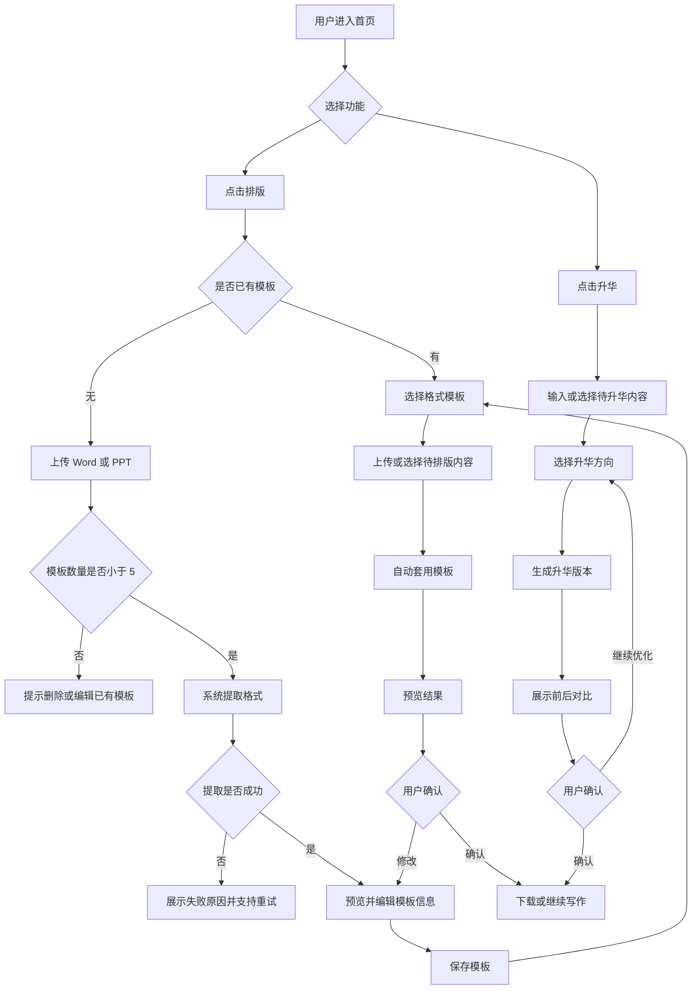

# 模力通首页「排版 / 升华」功能 PRD

## 1. 一句话价值主张

在首页对话框下方新增「排版」与「升华」入口，让用户可以一键套用个人格式模板并提升内容表达质量，减少重复排版与反复润色成本。

## 2. 用户故事

- 作为经常撰写公文的机关单位用户，我希望上传常用 Word 公文作为排版模板，以便下次生成内容后自动套用单位格式。
- 作为需要制作汇报材料的企业用户，我希望上传已有 PPT 提取版式规范，以便快速生成符合公司视觉风格的演示文稿。
- 作为内容创作者，我希望在完成初稿后点击「升华」，以便自动优化标题、结构、语气和表达质量。
- 作为团队管理员，我希望查看并编辑个人模板名称、适用场景和模板内容，以便保持团队常用模板准确可用。
- 作为新用户，我希望在首页直接看到「排版」和「升华」入口，以便不用学习复杂路径就能完成写作后的下一步处理。

## 3. 功能清单

### P0

- 首页新增入口：在对话框下方展示「排版」「升华」两个功能按钮，与现有写作、深度研究、AI PPT、会议纪要、阅读入口保持一致。
- 模板上传：支持用户上传 Word 或 PPT 文件作为格式来源。
- 格式提取：解析上传文件中的标题层级、字体、字号、行距、段距、页边距、页眉页脚、编号规则、PPT 母版、主题色、版式占位符等核心格式。
- 模板保存：提取完成后保存为用户个人格式模板，用于后续一键套用。
- 模板数量限制：每个用户最多保存 5 个格式模板。
- 一键套用排版：用户在写作结果或上传内容后选择模板，系统自动应用对应格式。
- 模板编辑：支持编辑模板名称、适用场景、默认状态和部分可配置格式项。
- 升华入口：用户可从首页或写作结果页触发内容升华。
- 内容升华：支持对文本进行结构优化、语言润色、重点强化和表达风格调整。

### P1

- 模板预览：提取完成后展示 Word/PPT 模板预览，用户确认后保存。
- 模板管理页：支持查看、重命名、编辑、删除、设为默认模板。
- 套用前后对比：展示原文与排版/升华后的差异，便于用户确认。
- 适用类型识别：根据当前内容类型推荐 Word 模板或 PPT 模板。
- 升华模式：提供「更正式」「更精炼」「更有说服力」「更适合汇报」等升华选项。
- 失败重试：格式提取或套用失败时支持重新上传、重新解析或下载原文件。

### P2

- 团队模板库：组织管理员可维护团队共享模板。
- 模板智能推荐：根据用户输入意图、历史使用和内容类型自动推荐模板。
- 模板版本管理：支持查看历史版本并回滚。
- 批量排版：支持一次上传多个文档并统一套用模板。
- 高级品牌规范：支持企业 Logo、主题色、字体包、封面/目录/结束页等品牌资产配置。

## 4. 核心流程图

## 5. 关键数据字段定义

| 字段名 | 类型 | 必填 | 说明 |
| --- | --- | --- | --- |
| user_id | string | 是 | 用户唯一标识 |
| template_id | string | 是 | 格式模板唯一标识 |
| template_name | string | 是 | 用户自定义模板名称 |
| template_type | enum | 是 | 模板类型：word、ppt |
| source_file_id | string | 是 | 原始上传文件 ID |
| source_file_name | string | 是 | 原始文件名称 |
| source_file_size | number | 是 | 原始文件大小，单位 byte |
| source_file_ext | enum | 是 | 文件扩展名：doc、docx、ppt、pptx |
| extract_status | enum | 是 | 提取状态：pending、processing、success、failed |
| extract_error_code | string | 否 | 提取失败错误码 |
| extracted_style_json | json | 是 | 提取后的结构化格式配置 |
| preview_file_id | string | 否 | 模板预览文件 ID |
| editable_config_json | json | 否 | 用户可编辑的模板配置项 |
| is_default | boolean | 是 | 是否为默认模板 |
| usage_count | number | 是 | 模板被套用次数 |
| last_used_at | datetime | 否 | 最近一次使用时间 |
| created_at | datetime | 是 | 模板创建时间 |
| updated_at | datetime | 是 | 模板更新时间 |
| polish_task_id | string | 否 | 升华任务唯一标识 |
| polish_mode | enum | 否 | 升华模式：formal、concise、persuasive、reporting、custom |
| polish_input_text | text | 否 | 升华前文本内容 |
| polish_output_text | text | 否 | 升华后文本内容 |
| polish_status | enum | 否 | 升华状态：pending、processing、success、failed |

## 6. 异常场景与边界条件

- 用户已保存 5 个模板时，不允许继续新增模板，需要提示删除、覆盖或编辑已有模板。
- 上传文件格式不支持时，需要明确提示仅支持 doc、docx、ppt、pptx。
- 上传文件过大、损坏、加密、空文件或无法解析时，需要提示原因并保留重新上传入口。
- Word/PPT 中存在系统不支持的字体、宏、复杂图表、嵌入对象或第三方插件元素时，需要降级提取并提示可能存在差异。
- PPT 模板包含多个母版或复杂动画时，优先提取静态视觉规范，不承诺保留动画效果。
- 模板提取耗时较长时，需要展示处理进度，允许用户离开页面后在任务完成时继续使用。
- 自动排版结果与原文结构不匹配时，需要保留原文内容完整性，不能因套用模板丢失正文、图片或表格。
- 模板编辑后，需要确认是覆盖当前模板还是另存为新模板，并继续遵守 5 个模板上限。
- 用户删除默认模板后，需要引导重新设置默认模板，或自动取消默认模板状态。
- 升华内容为空、过短或超出长度上限时，需要提示用户补充内容或拆分处理。
- 升华结果可能改变事实表达时，需要提示用户核对关键信息、数据和引用来源。
- 排版与升华同时使用时，需要明确执行顺序，建议先升华内容再套用排版模板。

## 7. 需要进一步澄清的点

- 「排版」模板需要支持到什么精度：只提取基础字体段落样式，还是需要完整复刻页眉页脚、目录、编号、多级标题、封面和 PPT 母版？
- 单个上传文件的大小上限、页数上限、PPT 页数上限分别是多少？
- 模板编辑允许用户编辑哪些字段：仅名称和标签，还是可以可视化编辑字体、字号、颜色、页边距、母版布局等格式？
- 「升华」的目标定义是什么：偏语言润色、结构重组、观点强化，还是结合行业知识进行内容扩写？
- 「升华」是否需要支持不同内容类型的专属策略，例如公文、汇报、研究报告、会议纪要、营销文案？
- 模板是否仅个人可见，后续是否需要团队共享、管理员审核或企业统一下发？
- 上传的 Word/PPT 是否涉及敏感数据合规要求，例如文件留存周期、加密存储、用户删除后的彻底清除？
- 自动排版后的交付格式是在线预览、下载 Word/PPT，还是直接进入现有写作编辑器继续编辑？
- 首页两个新入口的视觉优先级是否与现有「写作」「深度研究」「AI PPT」等入口完全一致？
