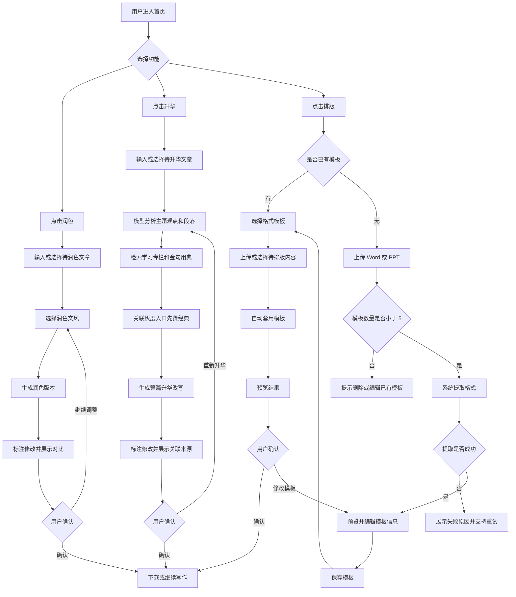

# 模力通首页「润色 / 升华 / 排版」功能 PRD

## 1. 一句话价值主张

在首页对话框下方新增「润色」「升华」「排版」入口，让用户完成写作后可以分别进行语言优化、经典理论关联升华与一键自动排版，提升文章表达质量、思想高度和交付效率。

## 2. 用户故事

- 作为经常撰写公文的机关单位用户，我希望上传常用 Word 公文作为排版模板，以便下次生成内容后自动套用单位格式。
- 作为需要制作汇报材料的企业用户，我希望上传已有 PPT 提取版式规范，以便快速生成符合公司视觉风格的演示文稿。
- 作为内容创作者，我希望在完成初稿后点击「润色」并选择文风，以便快速提升语言流畅度、表达准确性和整体可读性。
- 作为机关材料写作者，我希望在写完文章后点击「升华」，以便系统结合领导人讲话、金句用典和先贤经典发现内容关联并提升文章格局。
- 作为审稿人，我希望看到「升华」改写后的修改标注和关联来源，以便判断修改是否准确、合适且可追溯。
- 作为新用户，我希望在首页直接看到「润色」「升华」「排版」入口，以便不用学习复杂路径就能完成写作后的下一步处理。

## 3. 功能清单

### P0

- 首页新增入口：在对话框下方按「润色」「升华」「排版」顺序展示三个功能按钮，与现有写作、深度研究、AI PPT、会议纪要、阅读入口保持一致。
- 润色入口：用户可从首页或写作结果页触发文本润色。
- 文风选择：润色支持正式、公文、汇报、精炼、有感染力等文风选项。
- 润色生成：对文本做语言润色、病句修正、表达风格调整和可读性优化，不额外引入理论素材。
- 润色标注：对修改过的句子或段落做标注，支持查看原文与润色后内容。
- 升华入口：用户可从首页或写作结果页触发文章升华。
- 经典理论关联：升华结合「学习专栏」中的国家领导人讲话、「金句用典」和灰度入口「先贤经典」发掘与文章主题、观点、场景相关的素材。
- 升华整篇改写：基于关联素材直接改写文章，提升理论深度、思想高度、表达格局和论证力度。
- 升华修改标注：对升华改写过的标题、段落、句子和新增引用做标注。
- 来源展示：展示升华过程中引用或参考的关联来源，包括来源类型、标题、原文片段和关联理由。
- 模板上传：支持用户上传 Word 或 PPT 文件作为格式来源。
- 格式提取：解析上传文件中的标题层级、字体、字号、行距、段距、页边距、页眉页脚、编号规则、PPT 母版、主题色、版式占位符等核心格式。
- 模板保存：提取完成后保存为用户个人格式模板，用于后续一键套用。
- 模板数量限制：每个用户最多保存 5 个格式模板。
- 一键套用排版：用户在写作结果或上传内容后选择模板，系统自动应用对应格式。
- 模板编辑：支持编辑模板名称、适用场景、默认状态和部分可配置格式项。

### P1

- 模板预览：提取完成后展示 Word/PPT 模板预览，用户确认后保存。
- 模板管理页：支持查看、重命名、编辑、删除、设为默认模板。
- 前后对比：展示润色、升华或排版前后的差异，便于用户确认。
- 适用类型识别：根据当前内容类型推荐 Word 模板或 PPT 模板。
- 升华素材筛选：支持按来源类型筛选「学习专栏」「金句用典」「先贤经典」。
- 关联解释：展示每条来源与用户文章主题、论点或段落之间的关联理由。
- 失败重试：润色、升华、格式提取或套用失败时，支持重新生成、重新上传、重新解析或下载原文件。

### P2

- 团队模板库：组织管理员可维护团队共享模板。
- 模板智能推荐：根据用户输入意图、历史使用和内容类型自动推荐模板。
- 模板版本管理：支持查看历史版本并回滚。
- 批量排版：支持一次上传多个文档并统一套用模板。
- 高级品牌规范：支持企业 Logo、主题色、字体包、封面/目录/结束页等品牌资产配置。
- 升华素材收藏：用户可收藏常用讲话、金句或典故，后续优先用于升华。
- 先贤经典完整开放：灰度验证完成后，将「先贤经典」作为正式可选来源开放。

## 4. 核心流程图

## 5. 关键数据字段定义

| 字段名 | 类型 | 必填 | 说明 |
| --- | --- | --- | --- |
| user_id | string | 是 | 用户唯一标识 |
| template_id | string | 是 | 格式模板唯一标识 |
| template_name | string | 是 | 用户自定义模板名称 |
| template_type | enum | 是 | 模板类型：word、ppt |
| source_file_id | string | 是 | 原始上传文件 ID |
| source_file_name | string | 是 | 原始文件名称 |
| source_file_size | number | 是 | 原始文件大小，单位 byte |
| source_file_ext | enum | 是 | 文件扩展名：doc、docx、ppt、pptx |
| extract_status | enum | 是 | 提取状态：pending、processing、success、failed |
| extract_error_code | string | 否 | 提取失败错误码 |
| extracted_style_json | json | 是 | 提取后的结构化格式配置 |
| preview_file_id | string | 否 | 模板预览文件 ID |
| editable_config_json | json | 否 | 用户可编辑的模板配置项 |
| is_default | boolean | 是 | 是否为默认模板 |
| usage_count | number | 是 | 模板被套用次数 |
| last_used_at | datetime | 否 | 最近一次使用时间 |
| created_at | datetime | 是 | 模板创建时间 |
| updated_at | datetime | 是 | 模板更新时间 |
| polish_task_id | string | 否 | 润色任务唯一标识 |
| polish_mode | enum | 否 | 润色文风：formal、official、reporting、concise、expressive、custom |
| polish_input_text | text | 否 | 润色前文本内容 |
| polish_output_text | text | 否 | 润色后文本内容 |
| polish_status | enum | 否 | 润色状态：pending、processing、success、failed |
| polish_diff_json | json | 否 | 润色修改标注数据 |
| elevate_task_id | string | 否 | 升华任务唯一标识 |
| elevate_input_text | text | 否 | 升华前文章内容 |
| elevate_output_text | text | 否 | 升华后文章内容 |
| elevate_status | enum | 否 | 升华状态：pending、processing、success、failed |
| elevate_diff_json | json | 否 | 升华修改标注数据 |
| source_id | string | 否 | 关联来源唯一标识 |
| source_type | enum | 否 | 来源类型：learning_column、golden_quote、classic |
| source_title | string | 否 | 来源标题 |
| source_excerpt | text | 否 | 被引用或参考的原文片段 |
| source_relation | text | 否 | 来源与文章主题、观点或段落的关联理由 |
| source_availability | enum | 否 | 来源状态：available、gray、unavailable |

## 6. 异常场景与边界条件

- 用户已保存 5 个模板时，不允许继续新增模板，需要提示删除、覆盖或编辑已有模板。
- 上传文件格式不支持时，需要明确提示仅支持 doc、docx、ppt、pptx。
- 上传文件过大、损坏、加密、空文件或无法解析时，需要提示原因并保留重新上传入口。
- Word/PPT 中存在系统不支持的字体、宏、复杂图表、嵌入对象或第三方插件元素时，需要降级提取并提示可能存在差异。
- PPT 模板包含多个母版或复杂动画时，优先提取静态视觉规范，不承诺保留动画效果。
- 模板提取耗时较长时，需要展示处理进度，允许用户离开页面后在任务完成时继续使用。
- 自动排版结果与原文结构不匹配时，需要保留原文内容完整性，不能因套用模板丢失正文、图片或表格。
- 模板编辑后，需要确认是覆盖当前模板还是另存为新模板，并继续遵守 5 个模板上限。
- 用户删除默认模板后，需要引导重新设置默认模板，或自动取消默认模板状态。
- 润色内容为空、过短或超出长度上限时，需要提示用户补充内容或拆分处理。
- 润色文风选择与文章类型不匹配时，需要提示可能影响表达效果，但允许用户继续。
- 升华内容为空、过短或主题不明确时，需要提示用户补充背景、主题或关键观点。
- 升华检索不到高相关来源时，需要提示关联不足，并允许用户仅使用已找到来源或返回修改文章。
- 升华涉及「先贤经典」时，需要明确展示为灰度入口，避免用户误以为能力已完整开放。
- 升华结果引用或借鉴来源时，需要展示来源，并提示用户核对语境、事实和引用准确性。
- 升华改写可能改变原文立场或事实表达时，需要用修改标注提醒用户重点复核。
- 润色、升华与排版同时使用时，需要明确执行顺序，建议先润色语言，再升华格局，最后套用排版模板。

## 7. 需要进一步澄清的点

- 「排版」模板需要支持到什么精度：只提取基础字体段落样式，还是需要完整复刻页眉页脚、目录、编号、多级标题、封面和 PPT 母版？
- 单个上传文件的大小上限、页数上限、PPT 页数上限分别是多少？
- 模板编辑允许用户编辑哪些字段：仅名称和标签，还是可以可视化编辑字体、字号、颜色、页边距、母版布局等格式？
- 润色支持哪些固定文风，是否允许用户自定义文风提示词？
- 升华需要优先使用哪些来源：领导人讲话、金句用典、先贤经典之间是否有权重或顺序？
- 升华的来源展示需要精确到原文出处、发布时间、章节段落，还是只展示标题和片段？
- 升华改写的标注粒度是句子级、段落级，还是类似修订模式的逐字差异？
- 模板是否仅个人可见，后续是否需要团队共享、管理员审核或企业统一下发？
- 上传的 Word/PPT 是否涉及敏感数据合规要求，例如文件留存周期、加密存储、用户删除后的彻底清除？
- 自动排版后的交付格式是在线预览、下载 Word/PPT，还是直接进入现有写作编辑器继续编辑？
- 首页三个新入口的视觉优先级是否与现有「写作」「深度研究」「AI PPT」等入口完全一致？
